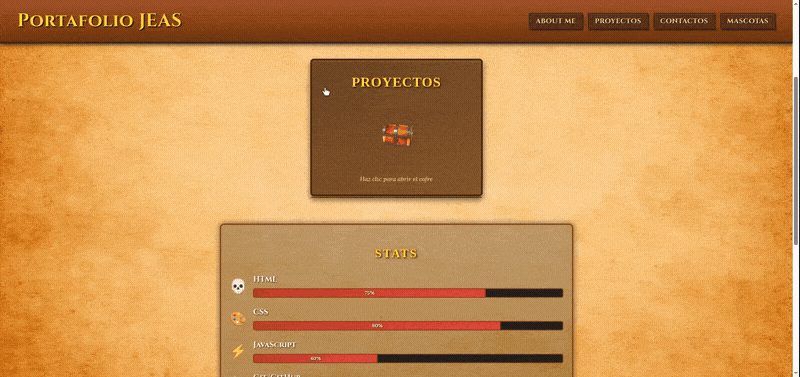

# ⚔️ RPG Portfolio - Jhonatan Ayala

Personal web portfolio with a The Elder Scrolls: Oblivion-inspired theme. Designed to showcase development projects while maintaining an immersive classic RPG experience.

**[🔗 Live Demo](https://jhonnyelithaz.github.io/)** | 



---

## 🛠️ Tech Stack

| Technology | Usage in the Project |
| --- | --- |
| *HTML5* | Semantic and accessible structure |
| *CSS3* | Styles, animations, responsive design, parchment theme |
| *Vanilla JavaScript* | DOM manipulation, events, sound effects |
| *Git / GitHub* | Version control and deployment |

*No frameworks*: 100% vanilla project to demonstrate mastery of web fundamentals.

---

## ✨ Key Features

### 1. *Diegetic RPG Interface*
- *Ancient parchment background*: Optimized .webp with preload for instant mobile loading.
- *Interactive project chest*: JS component that changes sprite and plays audio on open/close.
- *Thematic typography*: Medieval-style fonts to enhance immersion.

### 2. *Mobile-Optimized Code*
- *Render < 1s*: Background image < 300KB + base color to avoid white flash.
- *`background-attachment` fix*: Uses `scroll` on mobile to prevent repaint lag on iOS/Android.
- *Assets with `image-rendering: pixelated`*: Crisp pixel art without blur.

### 3. Advanced DOM Manipulation
```javascript
// Example: Sprite change + synchronized audio
cofre.addEventListener('click', () => {
  cofre.classList.toggle('abierto');
  imagenCofre.src = cofre.classList.contains('abierto')
    ? 'cofre-abierto.png'
    : 'cofre-cerrado.png';
  sonidoAbrir.currentTime = 0;
  sonidoAbrir.play();
});
```

---

## 🚀 Local Installation & Usage

1. Clone the repository
   ```bash
   git clone https://github.com/jhonnyelithAZ/jhonnyelithAZ.github.io.git
   ```

2. Navigate to the folder
   ```bash
   cd jhonnyelithAZ.github.io
   ```

3. Open with Live Server
   
   If you use VS Code, install the Live Server extension and right-click `index.html` > Open with Live Server.
   
   Or simply open `index.html` in your browser.

## 📂 Project Structure

```
/
├── index.html              # Main structure
├── styles.css              # All styles and media queries
├── script.js               # Chest logic and DOM events
├── public/
│   ├── img/
│   │   ├── back.webp       # Optimized parchment background
│   │   ├── cofre-cerrado.png
│   │   └── cofre-abierto.png
│   └── audio/
│       ├── cofre-abrir.mp3
│       └── cofre-cerrar.mp3
└── README.md
```

## 🎯 Technical Decisions & Learnings

| # | Problem | Solution | Learned Concept |
| --- | --- | --- | --- |
| **1** | Slow background on mobile + white flash | `rel="preload"` + image <300KB + `background-color` base | **Critical Rendering Path** |
| **2** | Lag with `fixed` on iOS | Media query `@media (max-width: 900px)` → `scroll` | **WebKit vs Chromium Rendering** |
| **3** | Audio didn't repeat on spam-click | `audio.currentTime = 0` before `play()` | **HTML5 Audio API** |
| **4** | Pixel art blurry when scaled | `image-rendering: pixelated` | **Image Rendering** |
| **5** | Demonstrate fundamentals without libraries | 100% **Vanilla JavaScript** | **Direct DOM Manipulation** |
| **6** | Messy structure | `/public/img` and `/public/audio` folders | **File Architecture** |

---

## 🗺️ Roadmap / Next Improvements

- [ ] **Particle system**: Add floating dust with Canvas for more immersion.
- [ ] **Custom cursor**: Change cursor to a sword or Oblivion-style cursor.
- [ ] **"Enchant item" mode**: Hover effect on project links with a glow.
- [ ] **Migrate to Vite**: To modularize JS without losing the vanilla focus.

---

## 📬 Contact

| Method | Information | Direct Link |
| --- | --- | --- |
| **Name** | Jhonatan Ayala | |
| **Role** | Frontend Developer | |
| **GitHub** | @jhonnyelithAZ | [View profile](https://github.com/jhonnyelithAZ) |
| **Email** | jhonatanayala3478@gmail.com | [Send email](mailto:jhonatanayala3478@gmail.com) |
| **Portfolio** | Live demo | [jhonnyelithaz.github.io](https://jhonnyelithaz.github.io) |
| **Location** | Barranquilla, Atlántico, Colombia | |
